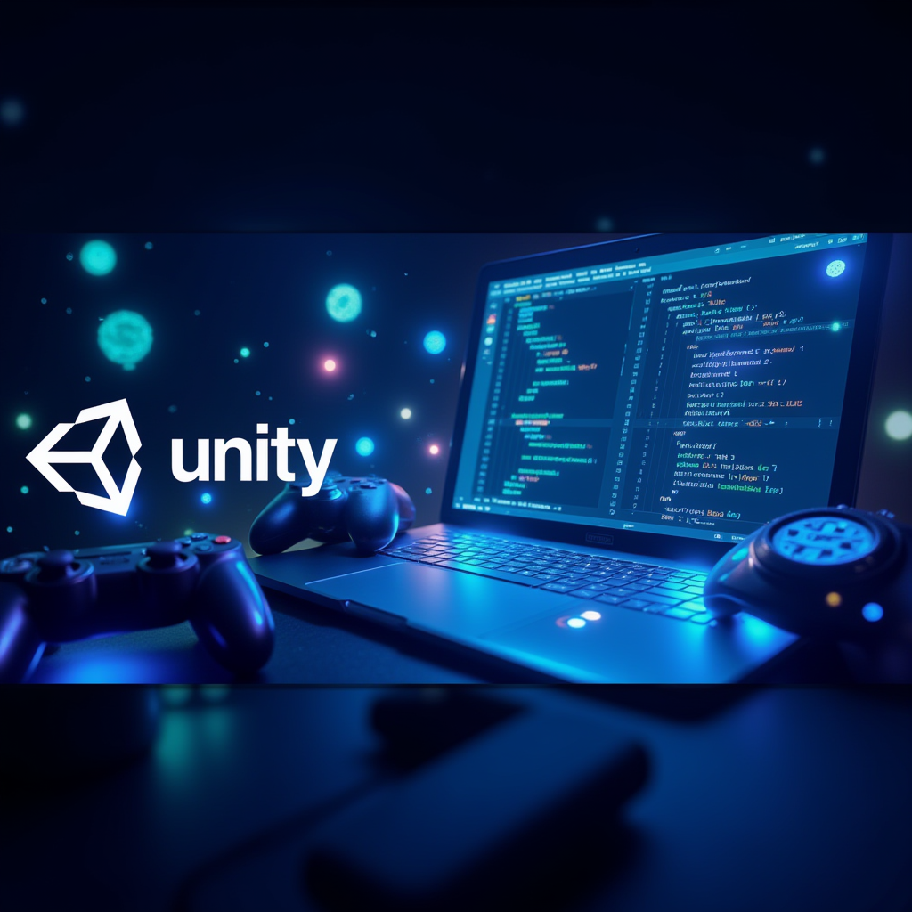

# C# Learning Journey
[live podcast] https://drive.google.com/file/d/1UAKSAnGSS8SjtPDe-q77Xm0bePW4BunI/view?usp=sharing

Welcome to my C# learning journey! I’m currently studying C# to develop the skills needed for game design and development with Unity. This README documents my progress and provides a curated list of helpful resources that have supported my learning.

**Project Status:**
> I aspire to be a game designer, so I’m actively studying C#. I've completed lessons on strings and am now moving on to numbers and loops.

---

## Learning Resources

### Recommended Tutorials & Guides
- **C# Official Documentation**: [Learn C# Basics](https://learn.microsoft.com/en-us/dotnet/csharp/tour-of-csharp/)
- **Microsoft’s Interactive Tutorials**: [Numbers in C#](https://learn.microsoft.com/en-us/dotnet/csharp/tour-of-csharp/tutorials/numbers-in-csharp?tutorial-step=1)
- **YouTube Series**: [C# Tutorial for Beginners](https://www.youtube.com/watch?v=Kg_k0vL0dD4&list=PLdo4fOcmZ0oULFjxrOagaERVAMbmG20Xe&index=8)

### Special Mention
- **Current Material Podcast**: This podcast offers insights into the latest trends and practical advice for developers. [Listen to the podcast](#)

---

## Progress Overview
### Completed Topics:
- Basic syntax and structure
- Strings: declaration, manipulation, and common methods

### Next Topics:
- Numbers and arithmetic operations
- Loops: `for`, `while`, `foreach` and practical use cases

I’m excited to continue my journey and appreciate any advice or recommendations you may have to help deepen my understanding of C# and game development concepts!

---
Stay tuned for updates as I progress through more advanced topics and begin integrating C# concepts into Unity game development!

C# and Unity for Game Development: A Study Guide
C# Fundamentals Review
Short Answer Quiz:
Explain the difference between the = operator and the == operator in C#.
What is the purpose of an if statement? Provide a simple C# code example.
Describe the concept of Object-Oriented Programming (OOP). What are the four core principles of OOP?
What are the differences between a for loop and a while loop in C#? Give a scenario where each would be preferred.
What is the role of a try-catch block in C#? How does it contribute to program stability?
Explain the concept of inheritance in OOP. Why is it a beneficial feature in programming?
Define delegates in C#. How are they used in the context of events?
What are lambda expressions in C#? Provide a simple example of how they can make code more concise.
Describe the purpose of the MonoBehaviour class in Unity. Name at least three common lifecycle methods within this class.
What are coroutines in Unity? Provide a scenario where a coroutine would be a useful tool in game development.
Short Answer Quiz Answer Key:
= is the assignment operator, used to assign a value to a variable. == is the equality comparison operator, used to check if two values are equal. Example: int x = 5; (assignment) vs. if (x == 5) { ... } (comparison).
An if statement executes a block of code only if a specified condition is true. Example:
if (playerHealth <= 0) {

   GameOver();

}

OOP is a programming paradigm that uses objects, which contain data (fields) and methods (functions), to structure code. The four principles are Encapsulation, Inheritance, Polymorphism, and Abstraction. OOP promotes modularity, reusability, and maintainability of code.
A for loop iterates a set number of times. A while loop continues as long as a condition is true. for is preferred for counting or iterating over a known range. while is preferred when the number of iterations is uncertain. Examples:
for (int i = 0; i < 10; i++) { ... }  // Counting to 10
while (playerAlive) { ... }          // Loop until player dies
A try-catch block handles exceptions (errors) during program execution. The try block contains code that may throw an exception, and the catch block executes if an exception occurs. This prevents the program from crashing and allows graceful error handling.
Inheritance allows one class (child class) to inherit properties and methods from another class (parent class). It promotes code reuse and establishes relationships between classes, making code organization more efficient.
Delegates are objects that reference methods. They enable methods to be passed as arguments to other methods. In events, delegates act as event handlers, defining what code should execute when an event occurs.
Lambda expressions are anonymous functions. They provide a concise way to define simple functions inline. Example: (x, y) => x + y is a lambda expression that adds two numbers.
MonoBehaviour is the base class for all Unity scripts. It provides a framework for interacting with the Unity engine and defines the script's behavior. Common lifecycle methods: Start(), Update(), and FixedUpdate().
Coroutines in Unity execute code over multiple frames. They are useful for tasks that need to happen over time, like animations, fades, or delays. Example: A coroutine can gradually fade out a UI element over several seconds.
Essay Questions:
Discuss the importance of understanding data types and variables in C# programming. How do strong data typing and proper variable management contribute to the reliability and readability of code?
Explain the concept of polymorphism in OOP. Provide examples of how polymorphism can be implemented using method overriding and interfaces in C#. How does polymorphism benefit game development?
Describe the role of delegates and events in building an event-driven architecture in a Unity game. Explain with a specific example how delegates and events can be used to create communication between different game objects or systems.
Discuss the advantages and potential challenges of using multithreading and asynchronous programming in C# for game development. Provide specific examples of how these techniques can enhance game performance or responsiveness.
Choose one or two common game architecture patterns (e.g., Singleton, Observer, Finite State Machine) and explain how they can be applied effectively in a Unity project. Illustrate your answer with concrete examples of how these patterns would improve code organization and maintainability.
Glossary of Key Terms:
Boolean (bool): A data type that can have one of two values: true or false.
Class: A blueprint for creating objects in OOP. It defines the data (fields) and methods (functions) that objects of that class will have.
Compiler: A program that translates source code (e.g., C#) into machine-readable instructions (executable code).
Conditional Statement: A statement that controls the flow of execution based on a condition (e.g., if, else if, switch).
Coroutine: A function in Unity that can pause execution and resume later, useful for tasks that happen over time.
Delegate: An object in C# that references a method, allowing methods to be passed as arguments.
Encapsulation: One of the core principles of OOP. It hides internal data and implementation details from the outside world, promoting data integrity and modularity.
Event: An occurrence in a program (e.g., a button click) that triggers a response.
Exception: An error that occurs during program execution, potentially disrupting the normal flow.
Inheritance: A mechanism in OOP that allows a class to inherit properties and methods from a parent class.
Interface: A contract in C# that defines a set of methods that a class must implement.
Lambda Expression: An anonymous function in C#, providing a concise way to define simple functions inline.
Loop: A control flow statement that repeatedly executes a block of code (e.g., for, while, foreach).
MonoBehaviour: The base class for all Unity scripts, providing methods for interacting with the Unity engine.
Object: An instance of a class in OOP. It contains data (fields) and can perform actions (methods).
Operator: A symbol that performs an operation on values or variables (e.g., +, -, *, /, =, ==).
Polymorphism: A principle in OOP that allows objects of different classes to be treated as objects of a common type. This allows for flexible and extensible code.
ScriptableObject: A data container in Unity that can be used to store and share data between scripts.
Variable: A named storage location in memory that holds a value.
White Space: Characters like spaces, tabs, and newlines, used for formatting and readability but generally ignored by the C# compiler.

[https://chatgpt.com/c/672e60b1-5a48-800e-9ade-e0548e215f10]

C# and Unity for Game Development: FAQ
1. What are the fundamental C# concepts I need for game development?
You'll need to understand the basic building blocks of C#:

Syntax and Structure: How to write code that the computer understands, including methods, classes, and proper formatting.
Data Types and Variables: Different types of information (numbers, text, true/false values) and how to store them in variables.
Operators: Symbols that perform actions on data, like math calculations or comparisons.
Control Flow: Using if statements for decision-making and loops (for, while) for repeating actions.
2. What intermediate C# concepts are important for game logic?
Once you have the basics, you'll move on to:

Functions and Methods: Reusable blocks of code that perform specific tasks.
Object-Oriented Programming (OOP): Organizing code using classes and objects, which bundle data and actions together.
Error Handling: Gracefully handling unexpected situations in your code to prevent crashes.
Collections: Managing groups of data using arrays, lists, and dictionaries.
3. What advanced C# topics are valuable in game development?
For more complex games, you might need:

Delegates and Events: Responding to specific events in the game, like a player taking damage.
Lambdas and LINQ: Writing concise and efficient code, especially when working with collections of data.
Generics: Creating reusable code that can work with different data types.
Multithreading: Running multiple parts of your game code simultaneously for smoother performance.
4. What C# skills are specific to working in Unity?
Unity has its own set of C# concepts:

MonoBehaviour: The foundation for all scripts in Unity, controlling how objects behave in your game.
Unity API: A vast library of functions for interacting with game objects, physics, graphics, input, and more.
Coroutines: Managing actions that happen over time, like animations or timed events.
ScriptableObjects: Creating reusable data containers that can be shared across your game.
5. How do I structure my C# code for better game organization?
Game architecture patterns help you write clean and maintainable code:

Singleton Pattern: Ensuring you only have one instance of a particular object, like a game manager.
Observer Pattern: Notifying different parts of your game when something important happens.
Finite State Machines: Managing the different states of your game or AI characters.
6. Are there any optional C# topics that would be beneficial?
These concepts are not always required but can be useful:

Memory Management: Understanding how C# uses memory to prevent performance issues.
Design Patterns: Learning common solutions to recurring software problems.
Unit Testing: Writing code to automatically test parts of your game and ensure they work correctly.
7. What is the best way to learn C# for Unity?
C# Fundamentals: Start with basic syntax, data types, and control flow.
OOP Concepts: Move on to classes, objects, and inheritance.
Start Using Unity: Begin building small projects in Unity to see C# in action.
Advanced C#: Gradually incorporate delegates, events, and multithreading.
Game Architecture: Use patterns to organize your code as your projects grow.
8. Is Unity and C# a good starting point for a CS career?
While Unity and C# can be a fun and engaging way to learn programming, it's a specialized area. For a broader CS career, focusing on fundamental CS concepts and exploring other programming languages may be more beneficial. Learning Unity can still be a valuable addition to your skillset and potentially lead to game development opportunities.